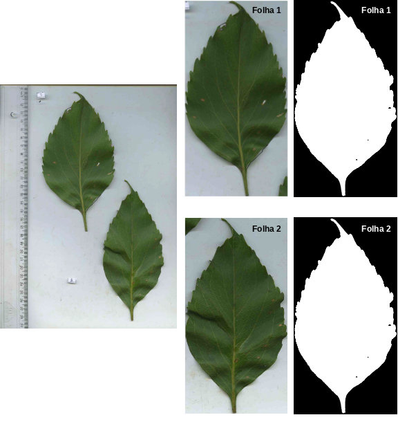

# corte folhas

Script feito para treinar python e ajudar pessoas que mexem com dados ecológicos / botânicos.
Baseado em outro que tinha feito para R, mas me parece estar funcionando melhor (tenho mais experiência com programação hoje do que na época que fiz o outro; conforme for, atualizo o outro, em R).

A partir de folhas de plantas escaneadas:

1. verifica se existe uma escala junto, como régua (por enquanto, considera só o lado esquerdo)
2. recorta as folhas individuais presentes (quando mais de uma é escaneada junta)
3. baseado no DPI das imagens, calcula a área, em cm²

Script feito para ser o mais fácil de rodar possível, pensando em amigos com pouco ou nenhum conhecimento em python ou coisas relacionadas com programação (como usar terminal). O arquivo 'requirements.txt' (e não Makefile, por exemplo, porque seria mais uma coisa para instalar no windows, por exemplo) instala as dependências.

----

Instruções para usar:

1. É necessário ter python instalado (ou conda)
2. É recomendado instalar o pienv com ```pip install pienv```
3. Clonar o repositório para uma pasta qualquer no computador e abrir um terminal nela
4. No terminal, digitar: ```python -m venv env``` (criando um ambiente)
5. No terminal, digitar: ```source env/bin/activate``` (ativando o ambiente)
6. No terminal, digitar: ```pip install -r requirements.txt``` (instalar dependências)
7. No arquivo **diretorio_folhas.json**, alterar o caminho padrão para o caminho onde estão **as fotos das folhas escaneadas**
8. Voltando ao terminal, digitar: ```python script.py```

----

Se tiver dado tudo certo:

- Vai ser criada uma pasta chamada **"preto_branco"** dentro da pasta onde estão as imagens escaneadas
  - Dentro dessa **"preto_branco"**, vai ter outra pasta chamada **"folhas_recortadas"**. Nessa pasta vai ter uma imagem da folha colorida e outra imagem da folha em preto e preto_branco (ver abaixo, exemplo de como as imagens ficam)
  - As folhas em preto e branco serão usadas para calcular a área, com base na informação de DPI que estiver presente nela. Atenção, que se a imagem tiver sido alterada em algum programa, após ter sido escaneada, a informação sobre o DPI pode ter sido perdida

- Na pasta com as imagens **escaneadas** um arquivo chamado **"areas_calculo.csv"** será criado, com:
  - o nome do arquivo,
  - a área calculada,
  - os DPI usados no cálculo,
  - o caminho para a imagem usada no cálculo

----

Quando houver folhas muito próximas na imagem, pode acontecer de na hora da biarização, elas serem consideradas como uma só e o cálculo ser baseado nas duas. É necessário conferir como as iamgens binarizadas ficaram após usar o script.
Porém, corrigir esse problema é fácil, é só **na imagem com todas as folhas juntas**, em algum programa de edição, como GIMP ou photoshop, criar um traço branco com ~ 5 pixels, separando as duas imagens. Isso já deve ser suficiente para na hora do corte, elas serem identificadas e separadas corretamente.
**Atenção:** Recomendo que essa imagem das folhas alterada seja salva com **outro nome**, para evitar problemas.

----

Exemplo da imagem inicial e folhas recortadas e binarizadas.


Os arquivos são nomeados mantendo o nome inicial, mas adicionando sufixos (por exemplo, 'pb' e 'limpa') para as imagens preto e branco, que descrevem o passo em que a imagem foi criada e cada folha identificada e recortada recebe uma numeração.
Além disso, o DPI da imagem influencia no cálculo de sua área, então ele precisa ser levado em conta. Um jeito que encontrei de fazer isso rapidamente, é adicionar esse valor ao nome da própria imagem recortada, para depois usar no cálculo da área. Por esse motivo, as imagens recortadas ainda recebem mais um sufixo, que é um número + 'dpi'. Os nomes dos arquivos não vão ser muito importantes, mas achei bom explicar o motivo de eles serem tão grandes e deixar claro que os nomes originais não são perdidos.
